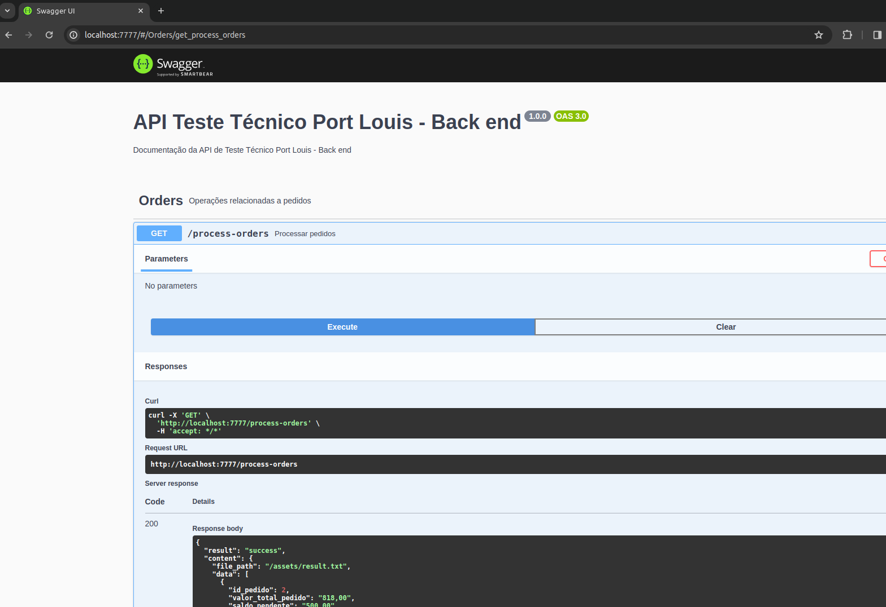

O projeto foi contruido em TypeScript com Node 20.11.0 e NPM 10.2.4

Primeiro instale as dependências

## Instalação

```bash

npm install

```

## Execute em modo desenvolvimento

Se você não tiver definido PORT no .env, então será porta http://localhost:7777

```bash

npm run start:dev

```

## Execute em modo produção

O modo produção faz o build e executa (Porta Padrão 7777, ou seja )

Se você não tiver definido PORT no .env, então será porta http://localhost:7777

```bash

npm run start:prod

```

